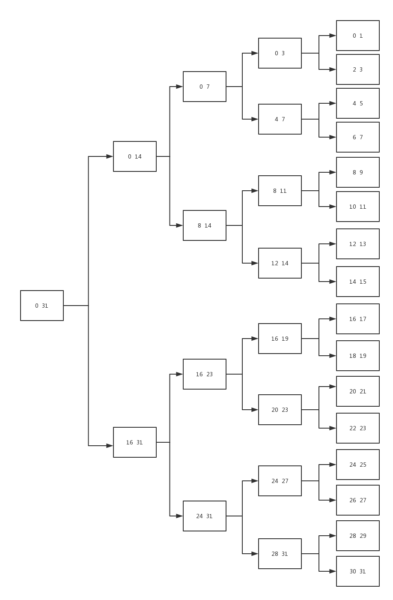

## Computer Organization HomeWork
#### 2017-3-19

---

### Register File

main.v

```verilog
module registerfile(
    Q1,Q2.DI,clk,reset written,AD,A1,A2
);
    output [31:0] Q1,Q2;
    input [31:0] DI;
    input clk,reset,written;
    input [4:0] AD,A1,A2;
    wire [31:0] decoderout,regen;
    wire [31:0] q[31:0];
	
    decoder dec_0(decoderout,AD);
    assign regen[0] = decoderout[0]& written;
    assign regen[1] = decoderout[1]& written;
    //省略
    assign regen[31] = decoderout[31]& written;

    regesiter reg_0(q[0],DI,clk,reset,regen[0]);
    regesiter reg_1(q[1],DI,clk,reset,regen[1]);
    //省略
    regesiter reg_31(q[31],DI,clk,reset,regen[31]);

    mux_32 mux_1(Q1,q,A1);
    mux_32 mux_2(Q2,q,A2);
endmodule

module dff(q,data,clk,reset,en)
	output q;
	input data,clk,reset,en;
	reg q;

	always@(posedge clk)
		begin
			if(reset)		q<=0;
			else		if(en)	q<=data;
			else 	q<=q;
		end
endmodule

module register(
    q,data,clk,reset,en
);
	output [31:0] q;
	input [31:0]data;
	input clk,reset,en;

	dff u_0(q[0],data[0],clk,reset,en);
	dff u_1(q[1],data[1],clk,reset,en); 
    // 省略
    dff u_31(q[31],data[31],clk,reset,en);
endmodule

module mux_32(
	output reg [31:0]q;
	input [31:0]q[31:0];
	input [4:0]raddr;
);	
	always@(raddr or q[31:0])
		case(raddr)
            5’d0:	q<=q[0];
            5’d1:	q<=q[1];
            // 省略
            5’d31:	q<=q[31];
            default: q<= X;
		endcase
endmodule

module decoder(
    decoderout,waddr
);
	output[31:0]decoderout;
	input[4:0] waddr;
	reg [31:0]decoderout;
	
	always@(wadder)
		case(wadder)
            5’d0:	decoderout<=32’b0000_00000_0000_0000_0000_0000_0000_0001;
            5’d1:	decoderout<=32’b0000_00000_0000_0000_0000_0000_0000_0010;
            // 省略
            5’d31:	decoderout<=32’b1000_00000_0000_0000_0000_0000_0000_0000;
            default:  decoderout<= 32’bxxxx_xxxx_xxxx_xxxx_xxxx_xxxx_xxxx_xxxx;
		endcase
endmodule
```

### 32-4g Decoder



### BigNumMult

```c
#include <stdio.h>
#include <stdlib.h>
#include <string.h>

#define N 100

// char[] To int[]
void getdigits(int *a, char *s) {
  int i;
  char digit;
  int len = strlen(s);

  // init Arr
  for (i = 0; i < N; ++i) *(a + i) = 0;
  for (i = 0; i < len; ++i) {
    digit = *(s + i);
    // back to first
    *(a + len - 1 - i) = digit - '0';
  }
}

// a mult b to c
void multiply(int *a, int *b, int *c) {
  int i, j;
  for (i = 0; i < 2 * N; ++i) *(c + i) = 0;

  for (i = 0; i < N; ++i)
    for (j = 0; j < N; ++j) *(c + i + j) += *(a + i) * *(b + j);
  for (i = 0; i < 2 * N - 1; ++i) {
    *(c + i + 1) += *(c + i) / 10;
    *(c + i) = *(c + i) % 10;
  }
}

int main() {
  int a[N], b[N], c[2 * N];
  char s1[N], s2[N];
  int j = 2 * N - 1;
  int i;

  printf("Input the first number:");
  scanf("%s", s1);
  printf("/nInput the second number:");
  scanf("%s", s2);

  getdigits(a, s1);
  getdigits(b, s2);

  multiply(a, b, c);

  while (c[j] == 0) j--;
  for (i = j; i >= 0; --i) printf("%d", c[i]);
  printf("/n");
  return 0;
}
```