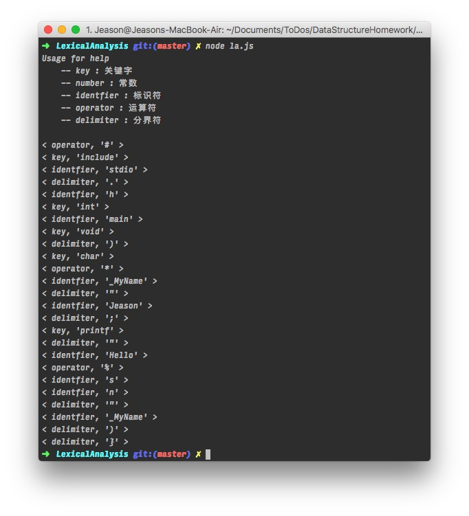

## 词法分析简介

> 词法分析（Lexical Analysis) 是编译的第一阶段。词法分析器的主要任务是读入源程序的输入字符、将他们组成词素，生成并输出一个词法单元序列，每个词法单元对应一个词素。这个词法单元序列被输出到语法分析器进行语法分析。

 - 词法单元：由一个词法单元名和一个可选的属性值组成。词法单元名是一个表示某种词法单位的抽象符号，比如一个特定的关键字，或者代表一个标识符的输入字符序列。词法单元名字是由语法分析器处理的输入符号。
 - 模式：描述了一个词法单元的词素可能具有的形式。
 - 词素： 源程序中的一个字符序列，它和某个词法单元的模式匹配，并被词法分析器识别为该词法单元的一个实例。 

## 思路说明

主要分析下面这段 c 语言程序

```cpp
#include <stdio.h>
int main(void) {
  char * _MyName = "Jeason";
  printf("Hello %s!\n", _MyName);
}
```

其原理是基于正则表达式的，比如下面：

```javascript
const keyWord = /auto|short|int|long|float|double|char|struct|union|include|enum|typedef|const|unsigned|signed|extern|register|static|volatile|void|if|else|switch|case|for|do|while|goto|continue|break|default|sizeof|return/g
const numberWord = /[0-9]+/g
const identfierWord = /[A-Za-z0-9_]+/g
const operatorWord = /\+|-|\*|\/|:=|>=|<=|#|=|%/g
const delimiterWord = /[,\.;{}()"\\]/g
```

对应匹配，输出结果：




## 一、实验目的

#### 实验1：词法分析器 

通过本实验的设计更具体的理解词法分析器的工作机制。同时更理解C语言的结构体系。从而更深刻的透析编译原理过程。 

#### 实验2：语法分析器 

了解掌握算符优先分析的基本方法、内容； 

学会科学思考并解决问题，提高程序设计能力。

## 二、实验设备（环境）及要求

实验硬件设备：PC机一台

实验软件要求：VSCode, NodeJS v7.9, Clang

## 三、实验原理与内容

1、实验1

（1）实验原理（算法流程）

设计c语言的词法分析器，结合状态转换图的原理完成对c语言源程序的基本单词的分析及提取，并设计相应的数据结构保存提取出来的单词。以及对c语言中的保留字的处理策略，实现一个完整的C语言的词法分析器的编写。

> 词法分析（Lexical Analysis) 是编译的第一阶段。词法分析器的主要任务是读入源程序的输入字符、将他们组成词素，生成并输出一个词法单元序列，每个词法单元对应一个词素。这个词法单元序列被输出到语法分析器进行语法分析。

 - 词法单元：由一个词法单元名和一个可选的属性值组成。词法单元名是一个表示某种词法单位的抽象符号，比如一个特定的关键字，或者代表一个标识符的输入字符序列。词法单元名字是由语法分析器处理的输入符号。
 - 模式：描述了一个词法单元的词素可能具有的形式。
 - 词素： 源程序中的一个字符序列，它和某个词法单元的模式匹配，并被词法分析器识别为该词法单元的一个实例。 

主要分析下面这段 c 语言程序

```cpp
#include <stdio.h>
int main(void) {
  char * _MyName = "Jeason";
  printf("Hello %s!\n", _MyName);
}
```

其原理是基于正则表达式的，比如下面：

```javascript
const keyWord = /auto|short|int|long|float|double|char|struct|union|include|enum|typedef|const|unsigned|signed|extern|register|static|volatile|void|if|else|switch|case|for|do|while|goto|continue|break|default|sizeof|return/g
const numberWord = /[0-9]+/g
const identfierWord = /[A-Za-z0-9_]+/g
const operatorWord = /\+|-|\*|\/|:=|>=|<=|#|=|%/g
const delimiterWord = /[,\.;{}()"\\]/g
```

对应匹配，输出结果

（2）实验内容
  - 源代码 

```javascript
let fs = require("fs");

const keyWord = /auto|short|int|long|float|double|char|struct|union|include|enum|typedef|const|unsigned|signed|extern|register|static|volatile|void|if|else|switch|case|for|do|while|goto|continue|break|default|sizeof|return/g
const numberWord = /[0-9]+/g
const identfierWord = /[A-Za-z0-9_]+/g
const operatorWord = /\+|-|\*|\/|:=|>=|<=|#|=|%/g
const delimiterWord = /[,\.;{}()"\\]/g

const allReg = /(auto|short|int|long|float|double|char|struct|union|include|enum|typedef|const|unsigned|signed|extern|register|static|volatile|void|if|else|switch|case|for|do|while|goto|continue|break|default|sizeof|return)|([0-9]+)|([A-Za-z0-9_]+)|(\+|-|\*|\/|:=|>=|<=|#|=|%)|([,\.;{}()"\\])/g

function readLines(input, func) {
    let remaining = ''
    input.on('data', function (data) {
        remaining += data
        let index = remaining.indexOf('\n')
        while (index > -1) {
            let line = remaining.substring(0, index)
            remaining = remaining.substring(index + 1)
            func(line)
            index = remaining.indexOf('\n')
        }
    })

    input.on('end', function () {
        if (remaining.length > 0) {
            func(remaining)
        }
    })
}

console.log(`Usage for help
    -- key : 关键字
    -- number : 常数
    -- identfier : 标识符
    -- operator : 运算符
    -- delimiter : 分界符
`)

let input = fs.createReadStream(__dirname + '/main.c')
readLines(input, startAnalysis)

function startAnalysis(data) {
    let thisMap = data.match(allReg)
    thisMap.map(r => {
        if (keyWord.test(r))
            console.log('< key, \'' + r + '\' >')
        else if (numberWord.test(r))
            console.log('< number, \'' + r + '\' >')
        else if (identfierWord.test(r))
            console.log('< identfier, \'' + r + '\' >')
        else if (operatorWord.test(r))
            console.log('< operator, \'' + r + '\' >')
        else if (delimiterWord.test(r))
            console.log('< delimiter, \'' + r + '\' >')
    })
}
```

