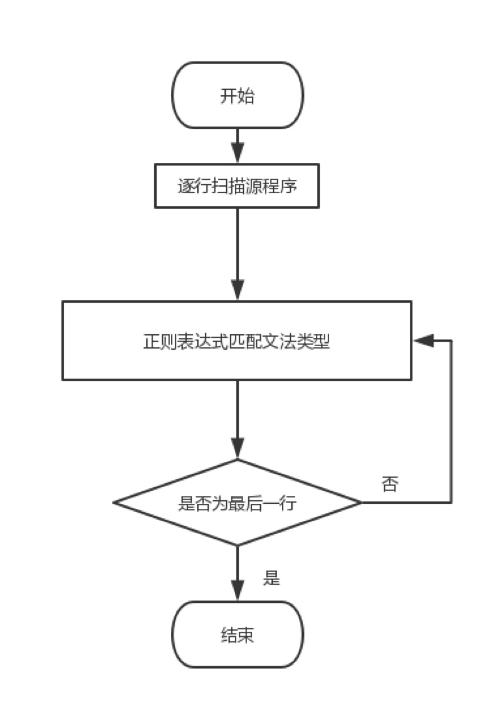
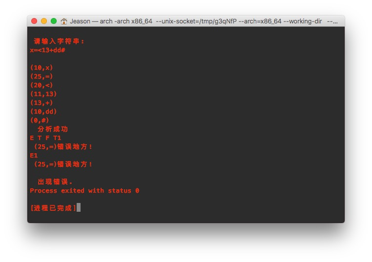

# 编译原理实验报告

## 一、实验目的

#### 实验1：词法分析器 

通过本实验的设计更具体的理解词法分析器的工作机制。同时更理解C语言的结构体系。从而更深刻的透析编译原理过程。 

#### 实验2：语法分析器 

了解掌握算符优先分析的基本方法、内容； 

学会科学思考并解决问题，提高程序设计能力。

## 二、实验设备（环境）及要求

实验硬件设备：PC机一台

实验软件要求：VSCode, NodeJS v7.9, Clang

## 三、实验原理与内容

1、实验1

（1）实验原理（算法流程）

设计c语言的词法分析器，结合状态转换图的原理完成对c语言源程序的基本单词的分析及提取，并设计相应的数据结构保存提取出来的单词。以及对c语言中的保留字的处理策略，实现一个完整的C语言的词法分析器的编写。

> 词法分析（Lexical Analysis) 是编译的第一阶段。词法分析器的主要任务是读入源程序的输入字符、将他们组成词素，生成并输出一个词法单元序列，每个词法单元对应一个词素。这个词法单元序列被输出到语法分析器进行语法分析。

 - 词法单元：由一个词法单元名和一个可选的属性值组成。词法单元名是一个表示某种词法单位的抽象符号，比如一个特定的关键字，或者代表一个标识符的输入字符序列。词法单元名字是由语法分析器处理的输入符号。
 - 模式：描述了一个词法单元的词素可能具有的形式。
 - 词素： 源程序中的一个字符序列，它和某个词法单元的模式匹配，并被词法分析器识别为该词法单元的一个实例。 

其原理是基于正则表达式的，比如下图：



```javascript
const keyWord = /auto|short|int|long|float|double|char|struct|union|include|enum|typedef|const|unsigned|signed|extern|register|static|volatile|void|if|else|switch|case|for|do|while|goto|continue|break|default|sizeof|return/g
const numberWord = /[0-9]+/g
const identfierWord = /[A-Za-z0-9_]+/g
const operatorWord = /\+|-|\*|\/|:=|>=|<=|#|=|%/g
const delimiterWord = /[,\.;{}()"\\]/g
```

对应匹配，输出结果，如下流程图：


（2）实验内容
  - 源代码 

```javascript
let fs = require("fs");

const keyWord = /auto|short|int|long|float|double|char|struct|union|include|enum|typedef|const|unsigned|signed|extern|register|static|volatile|void|if|else|switch|case|for|do|while|goto|continue|break|default|sizeof|return/g
const numberWord = /[0-9]+/g
const identfierWord = /[A-Za-z0-9_]+/g
const operatorWord = /\+|-|\*|\/|:=|>=|<=|#|=|%/g
const delimiterWord = /[,\.;{}()"\\]/g

const allReg = /(auto|short|int|long|float|double|char|struct|union|include|enum|typedef|const|unsigned|signed|extern|register|static|volatile|void|if|else|switch|case|for|do|while|goto|continue|break|default|sizeof|return)|([0-9]+)|([A-Za-z0-9_]+)|(\+|-|\*|\/|:=|>=|<=|#|=|%)|([,\.;{}()"\\])/g

function readLines(input, func) {
    let remaining = ''
    input.on('data', function (data) {
        remaining += data
        let index = remaining.indexOf('\n')
        while (index > -1) {
            let line = remaining.substring(0, index)
            remaining = remaining.substring(index + 1)
            func(line)
            index = remaining.indexOf('\n')
        }
    })

    input.on('end', function () {
        if (remaining.length > 0) {
            func(remaining)
        }
    })
}

console.log(`Usage for help
    -- key : 关键字
    -- number : 常数
    -- identfier : 标识符
    -- operator : 运算符
    -- delimiter : 分界符
`)

let input = fs.createReadStream(__dirname + '/main.c')
readLines(input, startAnalysis)

function startAnalysis(data) {
    let thisMap = data.match(allReg)
    thisMap.map(r => {
        if (keyWord.test(r))
            console.log('< key, \'' + r + '\' >')
        else if (numberWord.test(r))
            console.log('< number, \'' + r + '\' >')
        else if (identfierWord.test(r))
            console.log('< identfier, \'' + r + '\' >')
        else if (operatorWord.test(r))
            console.log('< operator, \'' + r + '\' >')
        else if (delimiterWord.test(r))
            console.log('< delimiter, \'' + r + '\' >')
    })
}
```

2、实验2

（1）实验原理

 - 语法分析的任务: 把单词符号作为基本单位,分析程序是否为合法的程序. 
 - 算符优先分析法是自下而上的语法分析方法，即根据文法,对输入字串进行归约,若能正确地归约为文法的初始符号,则表示输入字串是合法的. 
 - 该试验主要研究对输入的赋值语句、输出语句、清除语句进行词法分析、语法分析、表达式求值并存储于指定变量中；若存在错误，提示错误相关信息。

（2）实验内容

```cpp
#include <stdio.h>
#include <string.h>
char prog[800], token[20];
char ch;
int syn, p, m, n, sum;
char* rwtab[6] = {"begin", "if", "then", "while", "do", "end"};

void main() {
  p = 0;
  printf("\n 请输入字符串: \n");
  do {
    ch = getchar();
    prog[p++] = ch;
  } while (ch != '#');
  p = 0;
  do {
    scaner();
    switch (syn) {
      case 11:
        printf("\n(%d,%d)", syn, sum);
        break;
      case -1:
        printf("\n(%s,出错!)", token);
        break;
      default:
        printf("\n(%d,%s)", syn, token);
    }
  } while (syn != 0);
  printf("\n  分析成功 \n");
  p = 0;
  scaner();
  E();
  if (syn == 0)
    printf("\n 没有错误. \n");
  else
    printf("\n  出现错误. \n");
}

void scaner() {
  for (n = 0; n < 20; n++) token[n] = NULL;
  m = 0;
  sum = 0;
  ch = prog[p++];
  while (ch == ' ') {
    ch = prog[p++];
  }
  if (ch >= 'a' && ch <= 'z') {
    while (ch >= 'a' && ch <= 'z' || ch >= '0' && ch <= '9') {
      token[m++] = ch;
      ch = prog[p++];
    }

    syn = 10;
    p--;
    for (n = 0; n < 6; n++)
      if (strcmp(token, rwtab[n]) == 0) {
        syn = n + 1;
        break;
      }
  } else if (ch >= '0' && ch <= '9') {
    while (ch >= '0' && ch <= '9') {
      sum = sum * 10 + (ch - '0');
      ch = prog[p++];
    }
    syn = 11;
    p--;
  } else
    switch (ch) {
      case '<':
        token[m++] = ch;
        ch = prog[p++];
        if (ch == '>') {
          syn = 21;
          token[m++] = ch;
        } else if (ch == '=') {
          syn = 22;
          token[m++] = ch;
        } else {
          syn = 20;
          p--;
        }
        break;

      case '>':
        m = 0;
        token[m++] = ch;
        ch = prog[p++];
        if (ch == '=') {
          syn = 24;
          token[m++] = ch;
        } else {
          syn = 23;
          p--;
        }
        break;
      case ':':
        m = 0;
        token[m++] = ch;
        ch = prog[p++];
        if (ch == '=') {
          syn = 18;
          token[m++] = ch;
        } else {
          syn = 17;
          p--;
        }
        break;
      case '+':
        syn = 13;
        token[0] = ch;
        break;
      case '-':
        syn = 14;
        token[0] = ch;
        break;
      case '*':
        syn = 15;
        token[0] = ch;
        break;
      case '/':
        syn = 16;
        token[0] = ch;
        break;
      case '=':
        syn = 25;
        token[0] = ch;
        break;
      case ';':
        syn = 26;
        token[0] = ch;
        break;
      case '(':
        syn = 27;
        token[0] = ch;
        break;
      case ')':
        syn = 28;
        token[0] = ch;
        break;
      case '#':
        syn = 0;
        token[0] = ch;
        break;
      default:
        syn = -1;
        token[0] = ch;
    }
}

void E() {
  printf("E ");
  T();
  E1();
}

void E1() {
  printf("E1 ");
  if (syn == 13) {
    scaner();
    T();
    E1();
  } else {
    if (syn != 28 && syn != 0) error();
  }
}

void T() {
  printf("T ");
  F();
  T1();
}

void T1() {
  printf("T1 ");
  if (syn == 15) {
    scaner();
    F();
    T1();
  } else {
    if (syn != 28 && syn != 0 && syn != 13) error();
  }
}

void F() {
  printf("F ");
  if (syn == 27) {
    scaner();
    E();
    if (syn == 28)
      scaner();
    else
      error();
  } else if (syn == 11 || syn == 10)
    scaner();
}
void error() { printf("\n (%d,%s)错误地方! \n", syn, token); }
```


## 四、实验结果与分析

#### 实验1

主要分析下面这段 c 语言程序

```cpp
#include <stdio.h>
int main(void) {
  char * _MyName = "Jeason";
  printf("Hello %s!\n", _MyName);
}
```

结果为


#### 实验2

结果为


