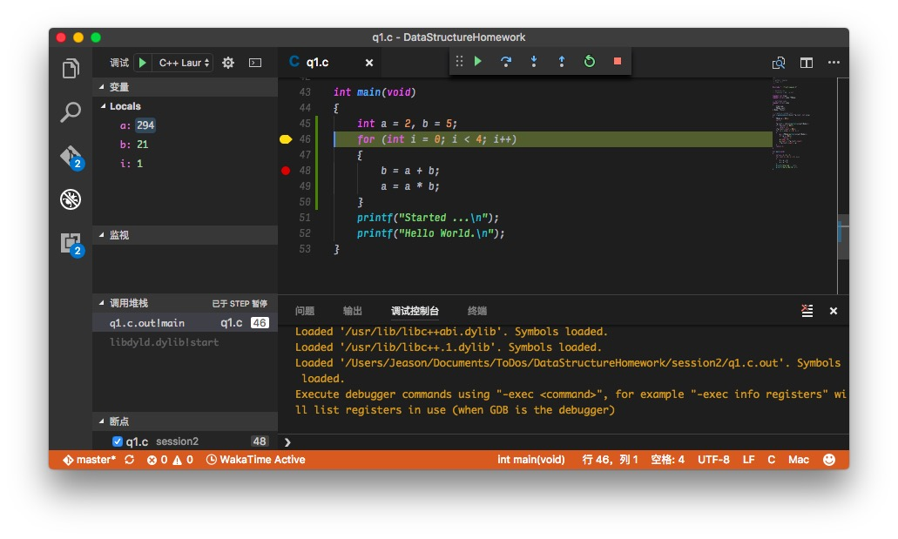

# DataStructureHomework
 数据结构课堂作业+大作业


在launch.json中会使用到一些预定变量, 这些变量的具体含义如下:

```bash
${workspaceRoot} the path of the folder opened in VS Code(VSCode中打开文件夹的路径)
${workspaceRootFolderName} the name of the folder opened in VS Code without any solidus (/)(VSCode中打开文件夹的路径, 但不包含"/")
${file} the current opened file(当前打开的文件)
${relativeFile} the current opened file relative to workspaceRoot(当前打开的文件,相对于workspaceRoot)
${fileBasename} the current opened file's basename(当前打开文件的文件名, 不含扩展名)
${fileDirname} the current opened file's dirname(当前打开文件的目录名)
${fileExtname} the current opened file's extension(当前打开文件的扩展名)
${cwd} the task runner's current working directory on startup()
```




H=(A,B,b2)=((a1,D,a3),(b1,b2,b3),b2)=((a1,(d1,d2,d3),a3),(b1,b2,b3),b2)